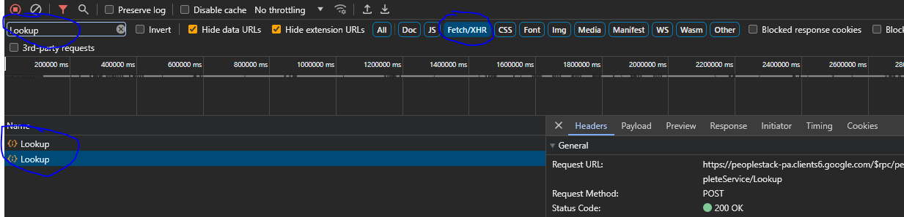
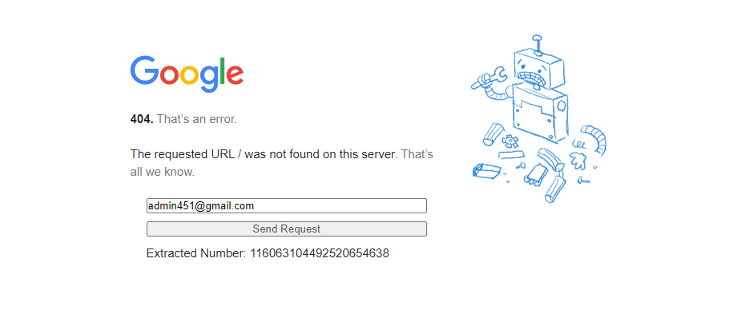

# Gaia_ID-OSINT
Obtain GAIA ID from email address

## STEPS!!!!

1. Go here: https://docs.google.com/document/
2. Create a document.
3. Click share and then click Inspect Element (Go to the Network tab)
4. Add a user with any email address. DO NOT ACTUALLY SEND THE INVITE
5. After their email is converted look in the NETWORK tab
6. Inspect the network request for Fetch/XHR and search for Lookup

  

 
8. Scroll to the bottom and copy the X-Goog-Api-Key. Also copy the authorization: SAPISIDHASH ( ON THE HEADERS TAB )

- Edit the tampermonkey script with your X-Goog-Api-Key and SAPISIDHASH near the top of the file.
- DO NOT SHARE THOSE

### Now head to: 
- https://clients6.google.com

####  On there you will see a box we have created.
1. Type in the email address
2. Profit

  

 

## Now you can also use google maps
- https://www.google.com/maps/contrib/1234567
  Replace the number on the end with the number from the email you received. 
